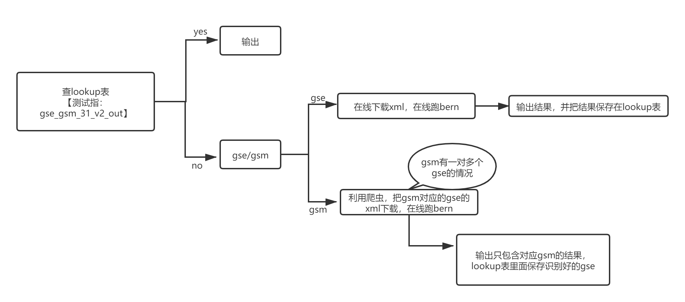

 # MP4压缩包
 录制代码在我本地电脑运行的情况
 
 # 测试代码
<ol>
<li>python3 pipeline_web.py gse -ge GSE117702 -ge GSE101 -o 0406_01  ###备注：GSE117702(在查询表中) ，GSE101(不在查询表中) </li>
<li>python3 pipeline_web.py gsm -gm GSM3307398 -gm GSM613385 -o 0406_02 ###备注：GSM3307398（在查询表里面，一个gsm对应一个gse) ，GSM613385（不在查询表里面，一个gsm对应两个gse） </li>
<li>python3 pipeline_web.py gsm -gm GSM613385 gse -ge GSE117702 -o 0406_03 ###备注：测试一个gse，一个gsm  报错！！！ </li>
</ol>

# 流程图

# 报错可能
#### selenium.common.exceptions.SessionNotCreatedException: Message: session not created: This version of ChromeDriver only supports Chrome version 79
#### 出现问题的原因：chromedriver 路径问题或者版本问题
#### 路径问题解决
#### 在normalize.py 把browser = webdriver.Chrome(options=option) 换成 browser = webdriver.Chrome(executable_path=r'D:\setup\anaconda\Scripts\chromedriver.exe',options=option) executable_path是chromedriver.exe 安装问题
#### 版本问题，对应chrome版本的chromedriver

# 注意
测试代码用"gse_gsm_31_v2_out" 作为lookup table，如果需要更换，请自行在代码中对应的位置进行修改

# 疑问
lookup table 查询的方式使用pandas包，不知道数据量大的时候查询速度情况

